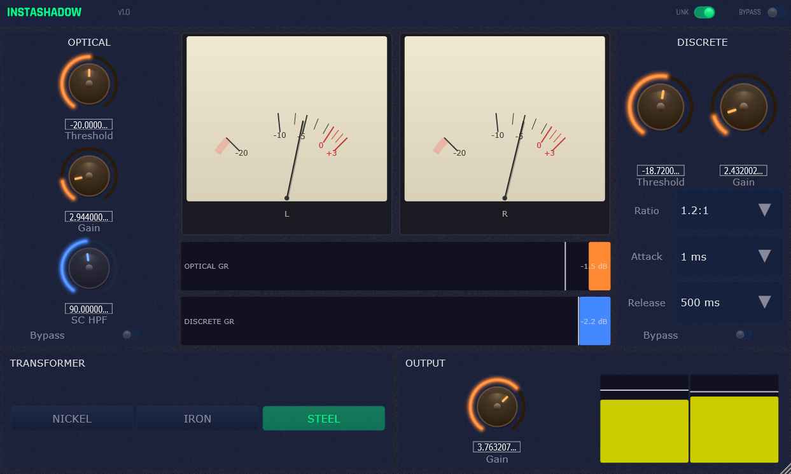

# InstaShadow

Free, open-source dual-stage mastering compressor plugin inspired by the Shadow Hills Mastering Compressor, built with JUCE. Available as VST3, AU and LV2.

      



## What Is This?

InstaShadow is a dual-stage mastering compressor that combines an **optical compressor** and a **discrete VCA compressor** in series, followed by a switchable **output transformer** saturation section. The design is inspired by the Shadow Hills Mastering Compressor — a legendary hardware unit used in professional mastering studios worldwide.

The optical stage provides smooth, program-dependent compression with a natural two-stage release, while the VCA stage offers precise, fast compression with selectable ratio, attack, and release settings. The transformer section adds subtle harmonic coloration with three distinct characters.

## Download

**[Latest Release: v1.0](https://github.com/hariel1985/InstaShadow/releases/tag/v1.0)**

### Windows
| File | Description |
|------|-------------|
| [InstaShadow-VST3-Win64.zip](https://github.com/hariel1985/InstaShadow/releases/download/v1.0/InstaShadow-VST3-Win64.zip) | VST3 plugin — copy to `C:\Program Files\Common Files\VST3\` |

### macOS (Universal Binary: Apple Silicon + Intel)
| File | Description |
|------|-------------|
| [InstaShadow-VST3-macOS.zip](https://github.com/hariel1985/InstaShadow/releases/download/v1.0/InstaShadow-VST3-macOS.zip) | VST3 plugin — copy to `~/Library/Audio/Plug-Ins/VST3/` |
| [InstaShadow-AU-macOS.zip](https://github.com/hariel1985/InstaShadow/releases/download/v1.0/InstaShadow-AU-macOS.zip) | Audio Unit — copy to `~/Library/Audio/Plug-Ins/Components/` |

### Linux (x64, built on Ubuntu 22.04)
| File | Description |
|------|-------------|
| [InstaShadow-VST3-Linux-x64.zip](https://github.com/hariel1985/InstaShadow/releases/download/v1.0/InstaShadow-VST3-Linux-x64.zip) | VST3 plugin — copy to `~/.vst3/` |
| [InstaShadow-LV2-Linux-x64.zip](https://github.com/hariel1985/InstaShadow/releases/download/v1.0/InstaShadow-LV2-Linux-x64.zip) | LV2 plugin — copy to `~/.lv2/` |

> **macOS note:** Builds are Universal Binary (Apple Silicon + Intel). Not code-signed — after copying the plugin, remove the quarantine flag in Terminal:
> ```bash
> xattr -cr ~/Library/Audio/Plug-Ins/VST3/InstaShadow.vst3
> xattr -cr ~/Library/Audio/Plug-Ins/Components/InstaShadow.component
> ```

## Signal Flow

```
Input → Sidechain HPF → Optical Compressor (T4B) → VCA Compressor → Transformer → Output
```

Each stage can be independently bypassed. The sidechain HPF prevents low-frequency energy from triggering excessive compression (pumping on bass-heavy material).

## Features

### Optical Compressor — Port-Hamiltonian T4B Model

The optical stage physically models the electro-optical attenuator (T4B) found in classic hardware compressors like the LA-2A. Rather than using simplified envelope followers, InstaShadow implements a **Port-Hamiltonian** energy-based model:

- **EL panel** modeled as a capacitive energy store — the audio signal charges the panel, which emits light proportional to stored energy
- **CdS photoresistor** modeled as a nonlinear dissipator — resistance follows the gamma curve `R = k · L^(-γ)` where γ ≈ 0.7
- **Implicit trapezoidal integration** with Newton-Raphson iteration (3-5 iterations per sample) for numerical stability
- **2x oversampling** for the implicit solver
- **CdS memory effect** — the photoresistor "remembers" past illumination, creating a natural two-stage release:
  - Fast phase (~60 ms): first 50-80% of gain reduction releases quickly
  - Slow phase (0.5-5 s): remaining recovery depends on how long and how hard the signal was compressed
- **Fixed 2:1 ratio** and **soft knee** emerge naturally from the physics — not explicitly coded
- **Program-dependent attack** (~10 ms average) — reacts differently to transients vs. sustained signals

| Control | Range | Default |
|---------|-------|---------|
| Threshold | -40 to 0 dB | -20 dB |
| Gain (makeup) | 0 to 20 dB | 0 dB |
| Sidechain HPF | 20 to 500 Hz | 90 Hz |
| Bypass | On/Off | Off |

### Discrete VCA Compressor

A feed-forward VCA compressor with precise, repeatable compression characteristics:

- **Soft-knee** gain computer (6 dB knee width) for transparent threshold behavior
- **7 ratio settings:** 1.2:1, 2:1, 3:1, 4:1, 6:1, 10:1, Flood (20:1)
- **6 attack presets:** 0.1 ms, 0.5 ms, 1 ms, 5 ms, 10 ms, 30 ms
- **6 release presets:** 100 ms, 250 ms, 500 ms, 800 ms, 1.2 s, **Dual**
- **Dual release mode** mimics the optical stage's two-stage behavior within the VCA:
  - Fast release envelope (~60 ms) handles the initial recovery
  - Slow release envelope (~2 s) handles the tail
  - The deeper (more compressed) of the two envelopes is used at any given moment

| Control | Range | Default |
|---------|-------|---------|
| Threshold | -40 to 0 dB | -20 dB |
| Gain (makeup) | 0 to 20 dB | 0 dB |
| Ratio | 1.2:1 — Flood | 2:1 |
| Attack | 0.1 ms — 30 ms | 1 ms |
| Release | 100 ms — Dual | 500 ms |
| Bypass | On/Off | Off |

### Output Transformer Saturation

Three switchable transformer types add subtle harmonic coloration, modeled with 4x oversampled waveshaping:

| Type | Character | Harmonics | Drive | Wet Mix |
|------|-----------|-----------|-------|---------|
| **Nickel** | Transparent, clean | Minimal | 1.05 | 30% |
| **Iron** | Warm, musical | Even-order (2nd) | 1.15 | 50% |
| **Steel** | Aggressive, present | Even + odd (2nd + 3rd) | 1.3 | 60% |

- Waveshaping: `tanh(drive · x) / drive` — preserves unity gain at low levels
- Even harmonics via `x · |x|` (asymmetric warmth)
- Odd harmonics via `x³` (edge and presence)
- Dry/wet blending keeps the effect subtle and musical
- Iron adds a +0.2 dB low shelf at 110 Hz
- Steel adds a +0.4 dB low shelf at 40 Hz
- 4x oversampling (JUCE polyphase IIR) prevents aliasing artifacts

### Metering

- **Analog-style needle VU meters** (L/R) with ballistic needle movement — cream-colored face, scale markings from -20 to +3 dB, red zone above 0 dB
- **Optical GR meter** — horizontal bar showing optical stage gain reduction
- **Discrete GR meter** — horizontal bar showing VCA stage gain reduction
- **Output VU meter** — vertical stereo bar meter in the output section

### Global Controls

| Control | Description |
|---------|-------------|
| Stereo Link | Links L/R sidechain for matched stereo compression. Off = dual-mono |
| Bypass | Global bypass — passes audio unprocessed |
| Output Gain | -12 to +12 dB final output level |

### GUI

- Layout inspired by the original Shadow Hills Mastering Compressor hardware
- Optical controls on the left, discrete controls on the right, meters in the center
- Transformer and output controls at the bottom center
- Dark modern UI with InstaDrums/InstaGrain visual style
- 3D metal knobs with multi-layer glow effects (orange for main controls, blue for sidechain HPF)
- Analog needle VU meters with inertial needle movement
- Carbon fiber background texture
- Rajdhani custom font (embedded)
- Fully resizable window (800×500 — 1400×900) with proportional scaling
- State save/restore — all settings recalled with DAW session

## How It Works

### The Port-Hamiltonian Approach

Traditional plugin compressors use simplified envelope followers with fixed attack/release time constants. This misses the complex, program-dependent behavior of real optical compressors.

InstaShadow uses a **Port-Hamiltonian** formulation — an energy-based modeling framework from mathematical physics. The system is described by two coupled energy ports:

1. **Port 1 (EL panel):** A capacitive energy store with Hamiltonian `H = q²/(2C)`. The audio signal drives charge into the capacitor, which converts electrical energy to light.

2. **Port 2 (CdS cell):** A nonlinear dissipative element whose resistance depends on illumination via a gamma curve. A separate "memory" state variable tracks accumulated illumination history, creating the characteristic two-stage release.

The coupled system is solved using **implicit trapezoidal integration** — a symplectic integrator that preserves the energy structure of the Hamiltonian. Newton-Raphson iteration (3-5 steps per sample) resolves the implicit equation at each time step. 2x oversampling ensures numerical stability.

This approach naturally produces:
- Program-dependent attack and release (emerges from the physics)
- Soft-knee compression (emerges from the nonlinear CdS gamma curve)
- Approximately 2:1 ratio (emerges from the voltage divider topology)
- Two-stage release with memory effect (emerges from the CdS illumination history)

None of these behaviors are explicitly programmed — they are consequences of the physical model.

## Building

### Requirements
- CMake 3.22+
- JUCE framework (cloned to `../JUCE` relative to project)

#### Windows
- Visual Studio 2022 Build Tools (C++ workload)

#### macOS
- Xcode 14+

#### Linux (Ubuntu 22.04+)
```bash
sudo apt-get install build-essential cmake git libasound2-dev \
  libfreetype6-dev libx11-dev libxrandr-dev libxcursor-dev \
  libxinerama-dev libwebkit2gtk-4.1-dev libcurl4-openssl-dev
```

### Build Steps

```bash
git clone https://github.com/juce-framework/JUCE.git ../JUCE
cmake -B build -G "Visual Studio 17 2022" -A x64    # Windows
cmake -B build -G Xcode                              # macOS
cmake -B build -DCMAKE_BUILD_TYPE=Release             # Linux
cmake --build build --config Release
```

Output:
- VST3: `build/InstaShadow_artefacts/Release/VST3/InstaShadow.vst3`
- AU: `build/InstaShadow_artefacts/Release/AU/InstaShadow.component` (macOS)
- LV2: `build/InstaShadow_artefacts/Release/LV2/InstaShadow.lv2`

## Tech Stack

- **Language:** C++17
- **Framework:** JUCE 8
- **Build:** CMake + MSVC / Xcode / GCC
- **Optical DSP:** Custom Port-Hamiltonian solver (implicit trapezoidal + Newton-Raphson)
- **VCA DSP:** Custom feed-forward compressor with soft-knee gain computer
- **Transformer DSP:** Custom waveshaping with `juce::dsp::Oversampling` (4x polyphase IIR)
- **Filters:** `juce::dsp::IIR` (sidechain HPF, tonestack EQ)
- **Font:** Rajdhani (SIL Open Font License)

## License

GPL-3.0
